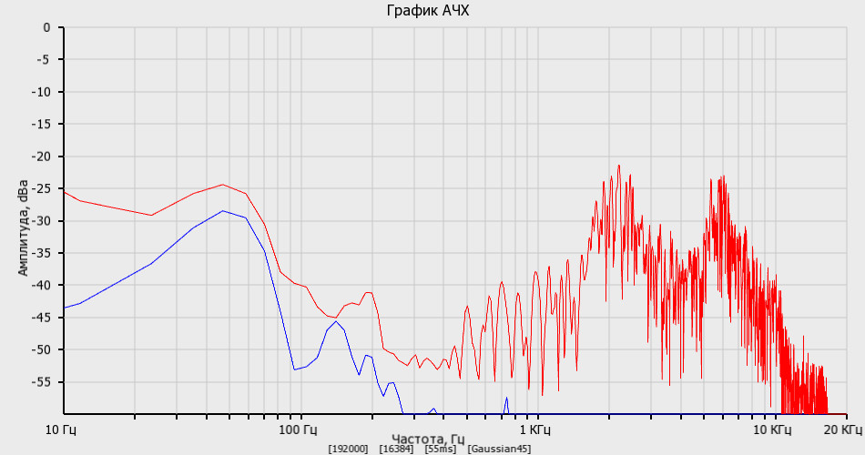

# Spectroscope
Спектроскоп для звуковой карты<br>
Написан в CodeBlocks, использует kissfft и sfml<br>
Распаковываем Spectroscope.zip в C:\Spectroscope<br>
Подключаем микрофон! (Без него не запустится)<br>
Не забыть поправить конфиг, и можно запускать командой:<br>
```Spectroscope.exe```<br>
Прога попытается найти Config.ini в каталоге, из которого запущена, и в этом файле все что ей надо...<br>
Исходники там же<br>
Вид программы:<br>

